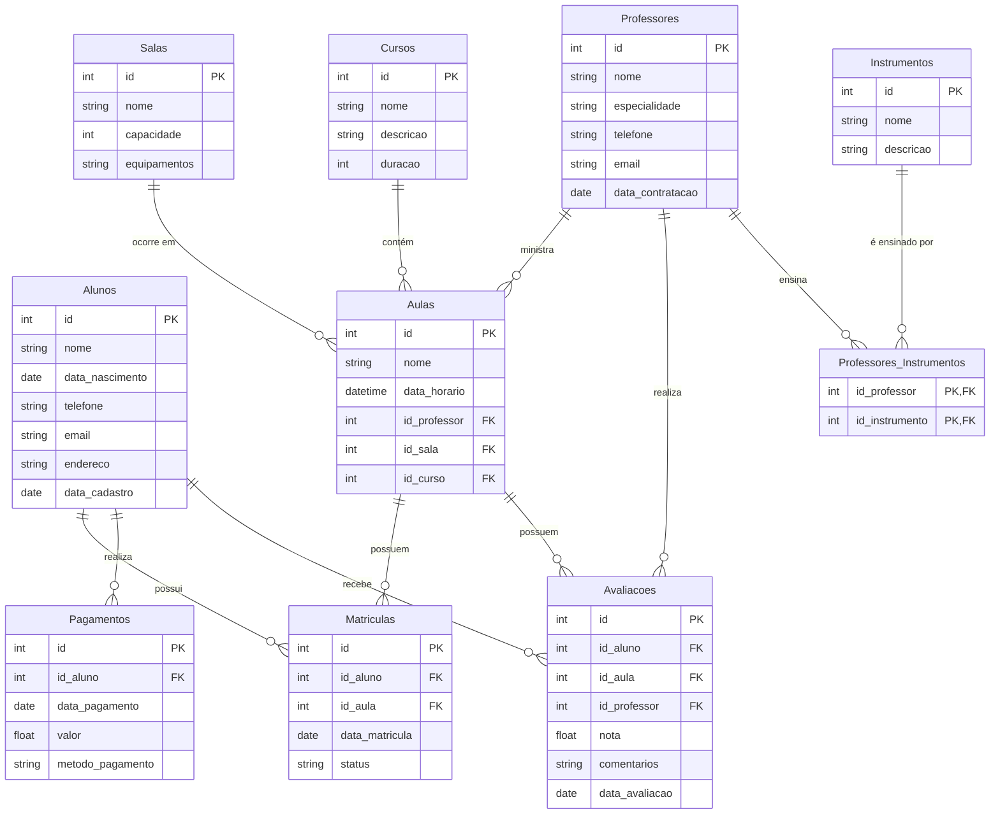

# 🎓 Modelagem de Banco de Dados para Escola de Música 🎵

Este projeto descreve a modelagem de um banco de dados para uma escola de música, incluindo entidades, atributos, relacionamentos e a implementação em PostgreSQL.

---

## 📚 Entidades Principais

### 🧑🎓 **Alunos**
- **Atributos**:
  - `id` (Chave Primária)
  - `nome` (VARCHAR)
  - `data_nascimento` (DATE)
  - `telefone` (VARCHAR)
  - `email` (VARCHAR)
  - `endereco` (VARCHAR)
  - `data_cadastro` (DATE)

### 👨🏫 **Professores**
- **Atributos**:
  - `id` (Chave Primária)
  - `nome` (VARCHAR)
  - `especialidade` (VARCHAR)
  - `telefone` (VARCHAR)
  - `email` (VARCHAR)
  - `data_contratacao` (DATE)

### 🏫 **Salas**
- **Atributos**:
  - `id` (Chave Primária)
  - `nome` (VARCHAR)
  - `capacidade` (INT)
  - `equipamentos` (VARCHAR)

### 📖 **Cursos**
- **Atributos**:
  - `id` (Chave Primária)
  - `nome` (VARCHAR)
  - `descricao` (TEXT)
  - `duracao` (INT)

### 🎼 **Aulas**
- **Atributos**:
  - `id` (Chave Primária)
  - `nome` (VARCHAR)
  - `data_horario` (TIMESTAMP)
  - `id_professor` (Chave Estrangeira)
  - `id_sala` (Chave Estrangeira)
  - `id_curso` (Chave Estrangeira)

### 🎻 **Instrumentos**
- **Atributos**:
  - `id` (Chave Primária)
  - `nome` (VARCHAR)
  - `descricao` (TEXT)

### 📝 **Matrículas**
- **Atributos**:
  - `id` (Chave Primária)
  - `id_aluno` (Chave Estrangeira)
  - `id_aula` (Chave Estrangeira)
  - `data_matricula` (DATE)
  - `status` (VARCHAR)

### 💰 **Pagamentos**
- **Atributos**:
  - `id` (Chave Primária)
  - `id_aluno` (Chave Estrangeira)
  - `data_pagamento` (DATE)
  - `valor` (DECIMAL)
  - `metodo_pagamento` (VARCHAR)

### 📊 **Avaliações**
- **Atributos**:
  - `id` (Chave Primária)
  - `id_aluno` (Chave Estrangeira)
  - `id_aula` (Chave Estrangeira)
  - `id_professor` (Chave Estrangeira)
  - `nota` (DECIMAL)
  - `comentarios` (TEXT)
  - `data_avaliacao` (DATE)

---

## 🔗 Relacionamentos

- **Alunos** ↔️ **Matrículas**: Um aluno pode ter várias matrículas (`1:N`).
- **Aulas** ↔️ **Matrículas**: Uma aula pode ter várias matrículas (`1:N`).
- **Professores** ↔️ **Aulas**: Um professor pode ministrar várias aulas (`1:N`).
- **Salas** ↔️ **Aulas**: Uma sala pode ser usada em várias aulas (`1:N`).
- **Cursos** ↔️ **Aulas**: Um curso contém várias aulas (`1:N`).
- **Professores** ↔️ **Instrumentos**: Relacionamento `N:N` via tabela `Professores_Instrumentos`.

---

## 📊 Modelo Lógico (Mermaid)



# 🛠️ Implementação no PostgreSQL
### Criação do Banco de Dados:
```sql
CREATE DATABASE escola_de_musica;
```
### Usando o Banco que acabamos de criar:
```sql
\c escola_de_musica;
```
### Tabela Alunos
```sql
CREATE TABLE Alunos (
    id SERIAL PRIMARY KEY,
    nome VARCHAR(100) NOT NULL,
    data_nascimento DATE NOT NULL,
    telefone VARCHAR(20),
    email VARCHAR(100),
    endereco VARCHAR(200),
    data_cadastro DATE NOT NULL
);
```
### Tabela Professores
```sql
CREATE TABLE Professores (
    id SERIAL PRIMARY KEY,
    nome VARCHAR(100) NOT NULL,
    especialidade VARCHAR(100),
    telefone VARCHAR(20),
    email VARCHAR(100),
    data_contratacao DATE NOT NULL
);
```
### Tabela Salas
```sql
CREATE TABLE Salas (
    id SERIAL PRIMARY KEY,
    nome VARCHAR(100) NOT NULL,
    capacidade INT NOT NULL,
    equipamentos TEXT
);
```
### Tabela Cursos
```sql
CREATE TABLE Cursos (
    id SERIAL PRIMARY KEY,
    nome VARCHAR(100) NOT NULL,
    descricao TEXT,
    duracao INT NOT NULL
);
```
### Tabela Aulas
```sql
CREATE TABLE Aulas (
    id SERIAL PRIMARY KEY,
    nome VARCHAR(100) NOT NULL,
    data_horario TIMESTAMP NOT NULL,
    id_professor INT REFERENCES Professores(id) ON DELETE CASCADE,
    id_sala INT REFERENCES Salas(id) ON DELETE CASCADE,
    id_curso INT REFERENCES Cursos(id) ON DELETE CASCADE
);
```
### Tabela Instrumentos
```sql
CREATE TABLE Instrumentos (
    id SERIAL PRIMARY KEY,
    nome VARCHAR(100) NOT NULL,
    descricao TEXT
);
```
### Tabela Matriculas
```sql
CREATE TABLE Matriculas (
    id SERIAL PRIMARY KEY,
    id_aluno INT REFERENCES Alunos(id) ON DELETE CASCADE,
    id_aula INT REFERENCES Aulas(id) ON DELETE CASCADE,
    data_matricula DATE NOT NULL,
    status VARCHAR(50) NOT NULL
);
```
### Tabela Pagamentos
```sql
CREATE TABLE Pagamentos (
    id SERIAL PRIMARY KEY,
    id_aluno INT REFERENCES Alunos(id) ON DELETE CASCADE,
    data_pagamento DATE NOT NULL,
    valor DECIMAL(10, 2) NOT NULL,
    metodo_pagamento VARCHAR(50) NOT NULL
);
```
### Tabela Avaliacoes
```sql
CREATE TABLE Avaliacoes (
    id SERIAL PRIMARY KEY,
    id_aluno INT REFERENCES Alunos(id) ON DELETE CASCADE,
    id_aula INT REFERENCES Aulas(id) ON DELETE CASCADE,
    id_professor INT REFERENCES Professores(id) ON DELETE CASCADE,
    nota DECIMAL(5, 2) NOT NULL,
    comentarios TEXT,
    data_avaliacao DATE NOT NULL
);
```
### Tabela Professores_Instrumentos (Relacionamento N:N entre Professores e Instrumentos)
```sql
CREATE TABLE Professores_Instrumentos (
    id_professor INT REFERENCES Professores(id) ON DELETE CASCADE,
    id_instrumento INT REFERENCES Instrumentos(id) ON DELETE CASCADE,
    PRIMARY KEY (id_professor, id_instrumento)
);
```

## 📥 Inserindo dados no Banco:
### Tabela Alunos:
```sql
INSERT INTO alunos (nome, data_nascimento, telefone, email, endereco, data_cadastro) VALUES
('João Silva', '2000-01-01', '11990000001', 'joao.silva@email.com', 'Rua das Flores, 123', '2023-10-01'),
('Maria Oliveira', '1999-02-15', '11990000002', 'maria.oliveira@email.com', 'Avenida Paulista, 456', '2023-10-01'),
('Carlos Santos', '2001-03-10', '11990000003', 'carlos.santos@email.com', 'Rua das Palmeiras, 789', '2023-10-01'),
('Ana Costa', '1998-04-20', '11990000004', 'ana.costa@email.com', 'Rua do Sol, 321', '2023-10-01'),
('Pedro Lima', '2002-05-25', '11990000005', 'pedro.lima@email.com', 'Avenida Central, 654', '2023-10-01'),
('Fernanda Souza', '2000-12-30', '11990000030', 'fernanda.souza@email.com', 'Rua das Acácias, 987', '2023-10-01');
```
### Tabela Professores:
```sql
INSERT INTO professores (nome, especialidade, telefone, email, data_contratacao) VALUES
('Luis Von Beethoven', 'Piano', '11980000001', 'beethoven@email.com', '2023-09-01'),
('Antonio Vivaldi', 'Violino', '11980000002', 'vivaldi@email.com', '2023-09-02'),
('Jamil Hendrix', 'Guitarra', '11980000003', 'hendrix@email.com', '2023-09-03');
```
### Tabela Salas:
```sql
INSERT INTO salas (nome, capacidade, equipamentos) VALUES
('Sala Beethoven', 20, 'Piano, Projetor'),
('Sala Vivaldi', 25, 'Violino, Quadro Branco'),
('Sala Hendrix', 30, 'Guitarra, Amplificador'),
('Sala Bach', 15, 'Cravo, Sistema de Som'),
('Sala Mozart', 10, 'Piano, Microfone');
```
### Tabela Cursos:
```sql
INSERT INTO cursos (nome, descricao, duracao) VALUES 
('Curso de Piano', 'Curso básico de piano', 6),
('Curso de Violão', 'Curso intermediário de violão', 8),
('Curso de Flauta Transversal', 'Curso de flauta transversal', 10);
```
### Tabela Aulas:
```sql
INSERT INTO aulas (nome, data_horario, id_professor, id_sala, id_curso) VALUES
('Aula de Piano 1', '2023-10-10 10:00:00', 1, 1, 1),
('Aula de Violino 1', '2023-10-11 11:00:00', 2, 2, 2),
('Aula de Guitarra 1', '2023-10-12 12:00:00', 3, 3, 3),
('Aula de Piano 2', '2023-10-13 13:00:00', 1, 1, 1),
('Aula de Violino 2', '2023-10-14 14:00:00', 2, 2, 2),
('Aula de Guitarra 2', '2023-10-15 15:00:00', 3, 3, 3),
('Aula de Piano 3', '2023-10-16 16:00:00', 1, 1, 1),
('Aula de Violino 3', '2023-10-17 17:00:00', 2, 2, 2),
('Aula de Guitarra 3', '2023-10-18 18:00:00', 3, 3, 3),
('Aula de Piano 4', '2023-10-19 19:00:00', 1, 1, 1);
```
### Tabela Instrumentos:
```sql
INSERT INTO instrumentos (nome, descricao) VALUES
('Piano', 'Instrumento de teclas, ideal para música clássica e contemporânea'),
('Violino', 'Instrumento de cordas, usado em orquestras e música solo'),
('Guitarra', 'Instrumento de cordas, popular em rock e blues'),
('Cravo', 'Instrumento de teclas, precursor do piano'),
('Flauta Transversal', 'Instrumento de sopro, usado em música clássica e popular');
```
### Tabela Matriculas:
```sql
INSERT INTO matriculas (id_aluno, id_aula, data_matricula, status) VALUES
(1, 1, '2023-10-05', 'Ativo'),
(2, 2, '2023-10-06', 'Ativo'),
(3, 3, '2023-10-07', 'Ativo'),
(4, 4, '2023-10-05', 'Ativo'),
(5, 5, '2023-10-06', 'Ativo'),
(6, 6, '2023-10-07', 'Ativo');
```
### Tabela Pagamentos:
```sql
INSERT INTO pagamentos (id_aluno, data_pagamento, valor, metodo_pagamento) VALUES
(1, '2023-10-05', 200.00, 'Cartão de Crédito'),
(2, '2023-10-06', 250.00, 'Boleto'),
(3, '2023-10-07', 200.00, 'Pix'),
(4, '2023-01-30', 00.00, 'Bolsa Integral'),
(5, '2023-02-22', 200.00, 'Cartão Débito'),
(6, '2023-11-10', 200.00, 'Pix');

```
### Tabela Avaliacoes:
```sql
INSERT INTO avaliacoes (id_aluno, id_aula, id_professor, nota, comentarios, data_avaliacao) VALUES
(1, 1, 1, 9.5, 'Ótima aula!', '2023-10-12'),
(2, 2, 2, 8.0, 'Bom desempenho.', '2023-10-13'),
(3, 3, 3, 7.5, 'Precisa melhorar.', '2023-10-14'),
(4, 4, 3, 7.5, 'Precisa melhorar.', '2023-10-14'),
(5, 5, 3, 7.5, 'Precisa melhorar.', '2023-10-14'),
(5, 6, 2, 7.5, 'Precisa melhorar.', '2023-10-14'),
(5, 7, 1, 7.5, 'Precisa melhorar.', '2023-10-14'),
(5, 8, 1, 7.5, 'Precisa melhorar.', '2023-10-14'),
(5, 9, 3, 7.5, 'Precisa melhorar.', '2023-10-14'),
(6, 10, 1, 10.0, 'Excelente!', '2023-10-30');
```
### Tabela Professores_Instrumentos:
```sql
INSERT INTO professores_instrumentos (id_professor, id_instrumento) VALUES
-- -- Associa cada professor a um instrumento único
(1, 1), -- Beethoven toca Piano
(2, 2), -- Vivaldi toca Violino
(3, 3); -- Hendrix toca Guitarra
```
## 🔍 Exemplo de Consultas
###  Listar todos os alunos e suas informações de contato:
```sql
SELECT 
    id, 
    nome, 
    telefone, 
    email, 
    endereco 
FROM 
    Alunos;
```
###  Listar todos os professores e os instrumentos que eles tocam:
```sql
SELECT 
    Professores.nome AS professor, 
    Instrumentos.nome AS instrumento 
FROM 
    Professores_Instrumentos
JOIN 
    Professores ON Professores_Instrumentos.id_professor = Professores.id
JOIN 
    Instrumentos ON Professores_Instrumentos.id_instrumento = Instrumentos.id;
```
###  Listar todas as aulas com informações do professor, sala e curso:
```sql
SELECT 
    Aulas.nome AS aula, 
    Aulas.data_horario, 
    Professores.nome AS professor, 
    Salas.nome AS sala, 
    Cursos.nome AS curso 
FROM 
    Aulas
JOIN 
    Professores ON Aulas.id_professor = Professores.id
JOIN 
    Salas ON Aulas.id_sala = Salas.id
JOIN 
    Cursos ON Aulas.id_curso = Cursos.id;
```
### Listar todos os cursos e sua duração:
```sql
SELECT 
    id, 
    nome, 
    descricao, 
    duracao 
FROM 
    Cursos;
```
