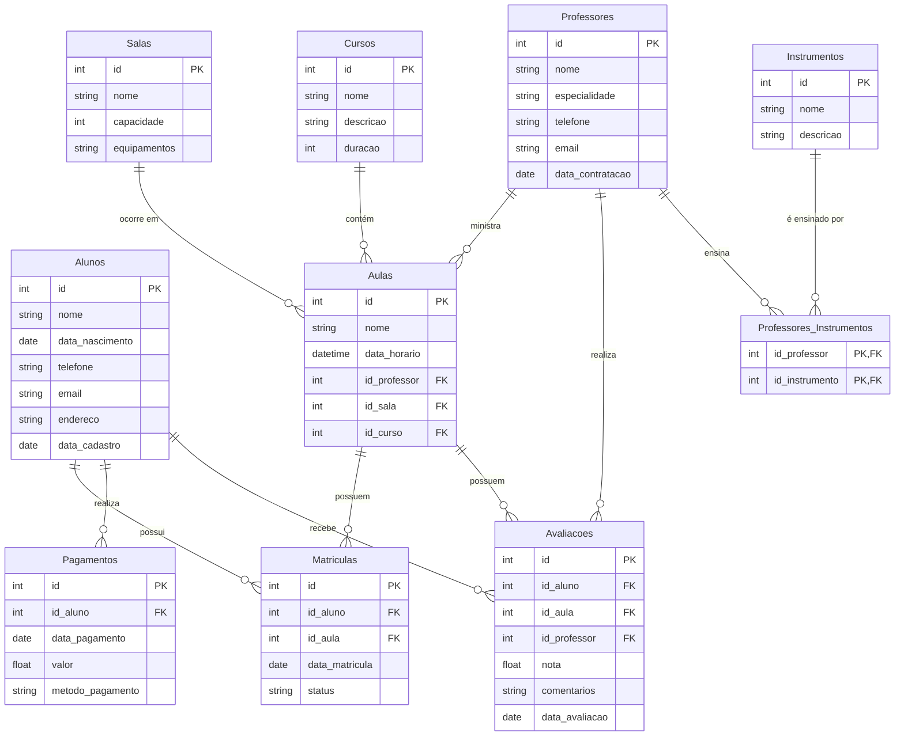

# Modelagem Escola[mermaid]

```mermaid
erDiagram
    Alunos {
        int id PK
        string nome
        date data_nascimento
        string telefone
        string email
        string endereco
        date data_cadastro
    }
    Professores {
        int id PK
        string nome
        string especialidade
        string telefone
        string email
        date data_contratacao
    }
    Salas {
        int id PK
        string nome
        int capacidade
        string equipamentos
    }
    Cursos {
        int id PK
        string nome
        string descricao
        int duracao
    }
    Aulas {
        int id PK
        string nome
        datetime data_horario
        int id_professor FK
        int id_sala FK
        int id_curso FK
    }
    Instrumentos {
        int id PK
        string nome
        string descricao
    }
    Matriculas {
        int id PK
        int id_aluno FK
        int id_aula FK
        date data_matricula
        string status
    }
    Pagamentos {
        int id PK
        int id_aluno FK
        date data_pagamento
        float valor
        string metodo_pagamento
    }
    Avaliacoes {
        int id PK
        int id_aluno FK
        int id_aula FK
        int id_professor FK
        float nota
        string comentarios
        date data_avaliacao
    }
    Professores_Instrumentos {
        int id_professor PK, FK
        int id_instrumento PK, FK
    }

    %% Relacionamentos
    Alunos ||--o{ Matriculas : "possui"
    Aulas ||--o{ Matriculas : "possuem"
    Professores ||--o{ Aulas : "ministra"
    Salas ||--o{ Aulas : "ocorre em"
    Cursos ||--o{ Aulas : "contém"
    Alunos ||--o{ Pagamentos : "realiza"
    Alunos ||--o{ Avaliacoes : "recebe"
    Professores ||--o{ Avaliacoes : "realiza"
    Aulas ||--o{ Avaliacoes : "possuem"
    Professores ||--o{ Professores_Instrumentos : "ensina"
    Instrumentos ||--o{ Professores_Instrumentos : "é ensinado por"
```
